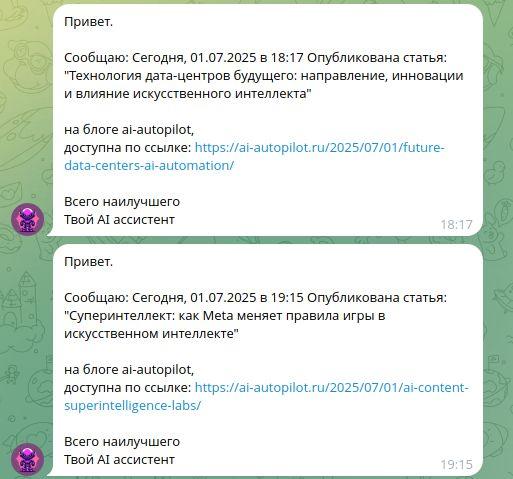
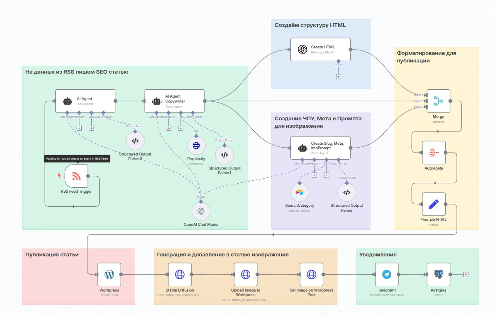
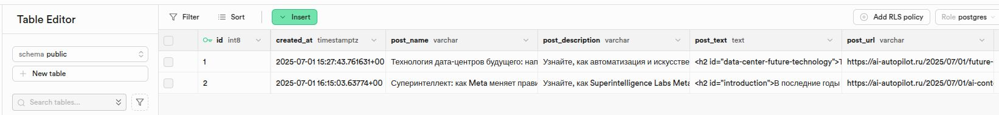
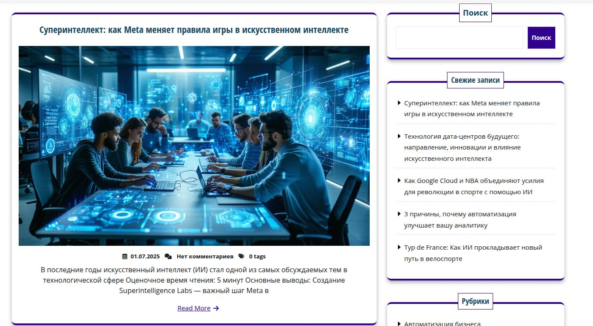
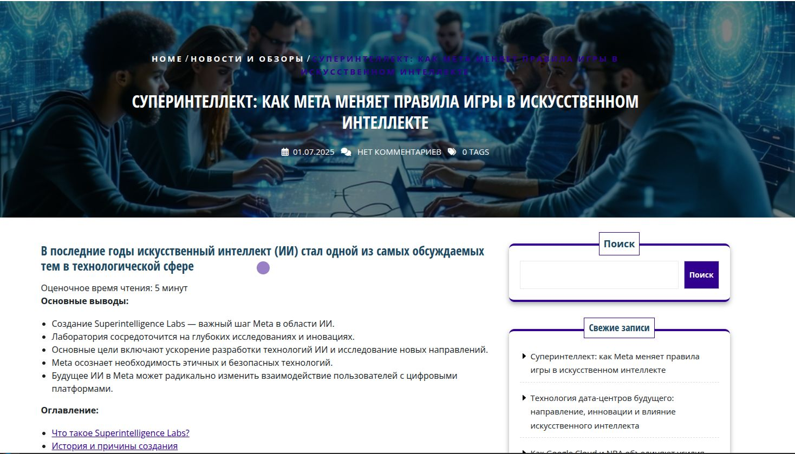

# 📚 AutoPublisher: SEO-статьи в WordPress из RSS с помощью AI

Этот проект демонстрирует, как с помощью связки **n8n**, **GPT-4**, **Stable Diffusion** и **WordPress API** можно автоматизировать публикацию SEO-оптимизированных статей.

---

## 🖼️ Демонстрация автоматизации

### 1. Telegram: Получение уведомлений о статусе публикации
Публикация статей сопровождается уведомлениями в Telegram, чтобы всегда быть в курсе.

---

### 2. n8n: Автоматизация логики и последовательности шагов
Визуальный сценарий в n8n связывает все инструменты и управляет потоком данных.

---

### 3. PostgreSQL: Хранение данных для дальнейшей аналитики
Структурированные данные сохраняются в PostgreSQL, включая результат генерации и публикации.

---

### 4. WordPress: Автоматически опубликованная статья
Готовая SEO-статья автоматически появляется в черновиках или в публикации.

---

### 5. WordPress: Открытая статья на сайте
Итог — опубликованная статья с HTML-форматированием, метаданными и изображением.

---

## ⚙️ Как это работает

1. RSS-лента инициирует запуск сценария
2. AI (OpenAI + Perplexity) обрабатывает текст и метаданные
3. Изображение генерируется по теме статьи
4. WordPress API публикует пост
5. Telegram уведомляет об успешной публикации

---

📎 Подробнее о проекте: [README_AI_AutoPublisher.md](README_AI_AutoPublisher.md)
